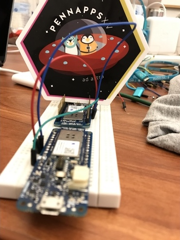

  
  
image source: <a href="https://www.facebook.com/pg/pennapps/photos/" itemprop="citation">PennApps facebook</a>
<!-- /.image-credit -->

<!-- /.page-image -->

> ###Our team wanted to incorporate machine learning and neural networks into our project for our own education. We identified a need for lightweight symmetric key exchange in the ever growing Internet of Things (IoT). 

# Introduction

For this blog post I won't go into  as much detail about the experience of this hackathon as I did my first post.
Mostly just because it wasn't as much of a roller-coaster of experiences. 
Though we still managed to have our fair share of hurdles to overcome.
Arguably our biggest hurdle happened at the very beginning.
Which had to do with this small matter of not having come up with hack to work on (suspense grows). 

# The Competition

This year our team was composed of reigning 3rd place finishers Sebastian, Rob and I along with hackathon newcomer, and fellow  physicist, Arjun.
So I actually had come in with a few potential ideas that we could work on.
One was what would have basically been an accelerometer+Arduino that you could attach to you washer/dryer and the idea would be to be you are able to monitor the cycle at some coarse level just based on some signal processing of the accelerometer data. 
This came from me having to use ancient washing machines in the basements of apartment building while myself living in the 3rd/4th floor. 
However not everyone on the team was super pumped about my smart washing machine idea :(. 
Well and also finding a washer/dryer which we could use to collect data with nearby the event venue was not super straight forward.
We all did converge on a set of ideas we would like to work with just out of our own interest, these being in the "whats-so-hot-right-now" machine learning/neural nets realm.
This guided by a lot of these side competitions put on by the sponsors that had their own prizes (things like "Best Finance Hack" sponsored by Capitol One and things like that).
The hard part then being manifesting this into a physical realizable two day project.
This brainstorming took up our entire first evening of the hackathon, which would definitely feed into a time crunch later in the competition.
With little to show for the first day of the competition we all headed home that evening hoping that inspiration would strike before the morning. 
Luckily inspiration struck our boy Arjun, who came in hot the next morning with a banger of an idea. 
I can't speak for everyone but I immediately thought it was awesome.
And we pretty quickly decided to go all in on this hack. 

Here's the pitch:

> Embedded devices in household or everyday items do not have much processing power or memory; nevertheless, there is a great need to secure these devices from attackers. 
> State-of-the-art exchange schemes such as Diffie-Hellman asymmetric exchange are arithmetically expensive, a fact that prohibits their implementation on constrained-memory systems that sometimes use integer widths as small as 8 bits.
> This observation led us to the idea of Tree Parity Machine symmetric key exchange, an idea pioneered by physicists in the early 2000's ([paper here](https://arxiv.org/abs/cond-mat/0208453)), and we tested their feasibility on an Arduino system.

# Theoretical Framework 

For those who don't like to have a cryptography paper thrust upon them as required reading in the middle of some random blog post I'll try do distill the main points here. 
Using the neural net diagram on the right we will walk through what Kanto and Kinser proved in their paper. 

  
  <figcaption class="fig-spacing"><i>A Tree Parity Machine nueral network. Two TPMs of identical topology are needed for the key exchange.</i></figcaption>
  
image source: <a href="https://" itemprop="citation">Wikipedia</a>
<!-- /.image-credit -->

<!-- /.page-image -->

<!-- /.page-image -->

For starters the thing in the figure on the right is called a "Tree Parity Machine" (TPM), which is a special type of multi-layered feedforward neural network. 
In this scheme we have two TPMs of identical structure, tree $A$ and tree $B$.
The same set of $K$ random input vectors $\vec{x}_{i}$ of size $N$ are fed into each TPM.
Then *different* sets of $K$ random weight vectors $\vec{w}_{i,j}^{A/B}$ of size $N$ are applied on each TPM.
The vectors can take on the following values:

$$
\vec{w}_{i,j}^{A/B} \in \{-L,-L+1,...,L-1,L\};
$$

$$
x_{i,j}\in \{-1,+1\}
$$

The input values are then weighted according to the Hebbian rule:
$$
\vec{w}_{i}^{A}(t+1)=\vec{w}^{A}_{i}(t)+\vec{x}_{i}
$$

I'll spend a little more time here since this is essentilly the main logical crux of the entire process.
So this Hebbian rule, or Hebbian learning, is something that comes out of neuroscientific theory and is often summerized as "cells that fire together wire together."
So a Hebbian rule is a rule that increases (updates) weights (influence) of the network if the neurons of the network are activating together.
We will come back to the specifics of how this plays into our TPMs when we go through the actual training procudure.
The sign of the inner product of the weight vector and input vactor is taken.

$$
\sigma_{i}^{A}=sign(\vec{w}_{i}^{A} \cdot \vec{x}_{i});  \hspace{1cm}  \sigma_{i}^{B}=sign(\vec{w}_{i}^{B} \cdot \vec{x}_{i})
$$

The product of these sigmas is taken resulting in a final output value of +1 or -1.

$$
\tau^{A}=\sigma_{1}^{A}\sigma_{2}^{A}\sigma_{3}^{A}; \hspace{1cm} \tau^{B}=\sigma_{1}^{B}\sigma_{2}^{B}\sigma_{3}^{B}
$$

The training, and therefore synchronization, are acheived by comparing the outputs between the two trees, only updating the weights of both trees if the outputs are *not* the same.
Random input vectors are continually generated and input into the TPMs and weights updated (or not) according to the scheme that was laid out.
The beautiful thing that happens next is that the weights themsleves, in each tree, will synchronize.

<video width="100%" height="auto" autoplay loop muted playsinline controls src="/video.webm"></video>
<figcaption class="fig-spacing"><i>gif of the two TPMs syncronizing as they train each other. The colored lines represent different weights as the training progresses. The  </i></figcaption>

<!-- /.page-image -->
We now have a secure method of symmetric key transfer.
All the two parties involved have to do is agree on a nueral net topology (within the allowed TPM structure) and follow the prescrition layed out above to be able to securely communicate with each other. 
A great visualization that I made during the competition (judges love visuals) is the video on the right where the weights are depicted as the colored lines that extend from the input neurons to the inner layer.
The weights are mapped to some color spectrum and so as the weights change the colors change.
The first two networks are the two TMPs (A and B) and the third network is just the difference between the weights of network A and B.
In this way it is easy to see when the networks synchronize as the third network will become a single bright green.
In real time the network synchronizes very quickly but I have slowed it down here just to show the adventure it takes. 
Feel free to skip to the end to see it synchronize. 
Now that we are done with that bit of book learnin' we can get back to the hack. 

# The Hack

Using two Arduinos, we attempt to have them exchange secret keys using tree parity machine feed-forward neural networks.
By having pre agreed upon identical neural net topologies, with randomized weights installed on each Arduino, the Arduinos train each others weights depending on whether their outputs match.
After a short training period the weights become identical in each device and are used as the agreed upon key.
We benchmarked our system by using a state-of-the-art Diffie-Hellman elliptic curve symmetric key exchange implementation, optimized for the Arduino microcontroller.
This is applicable in the emerging area of light weight cryptography (in particular, symmetric key exchange) which is necessary for secure communication between small devices that exist in the IoT.

<figcaption class="fig-spacing"><i>My attempt to get featured on the PennApps SnappChat story. Also our two Arduinos doing some Tree Parity Machine symmetric key exchange :)</i></figcaption>

<!-- /.page-image -->

Hardware: Two Arduino MKR1000's were attached to your standard bread board

Software: We began with a high-level Python implementation of a tree parity machine simulator. 
This formed the basis of a C (and eventually Arduino-compatible) implementation of a two-party tree parity machine key exchanger. 
The Diffie-Hellman elliptic curve key exchanger was implemented and heavily optimized as an open-source project at ArduinoLibs.

# Challenges We Ran Into

Translating python code into c code, and then into ARM compilable code proved to be challenging. 
The theory behind both neural networks and cryptography is complicated, and we needed to understand several relatively recent scientific papers before even beginning to write any code.

# Accomplishments We are Proud of

We went way out of our comfort zone in working with embedded systems, neural networks, cryptography, serial communication, and then combining all of these things. 
We learned a lot and are happy we were able to work through the challenges.

