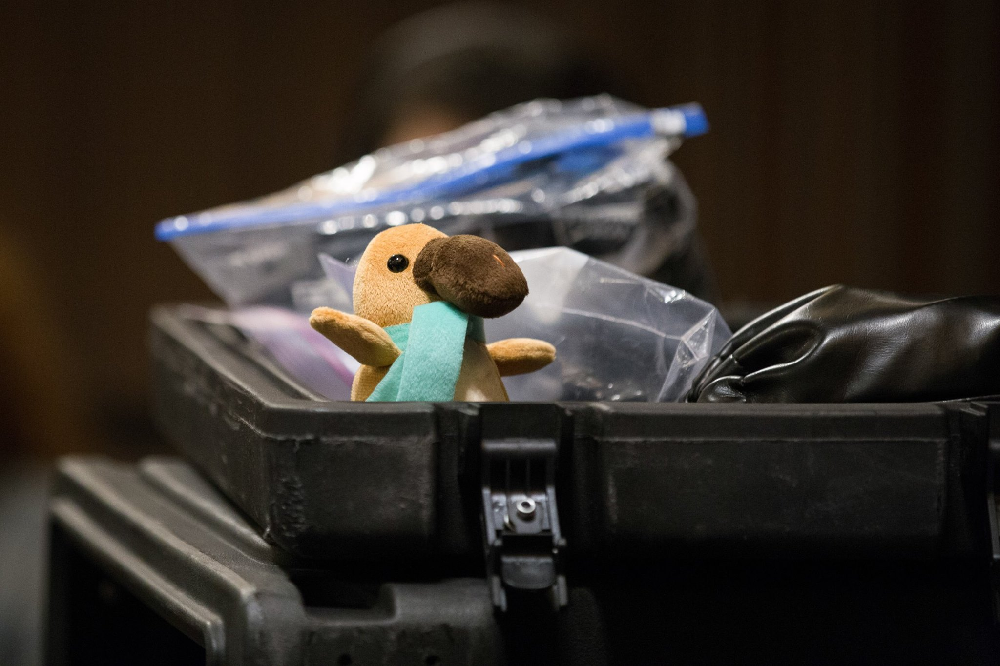
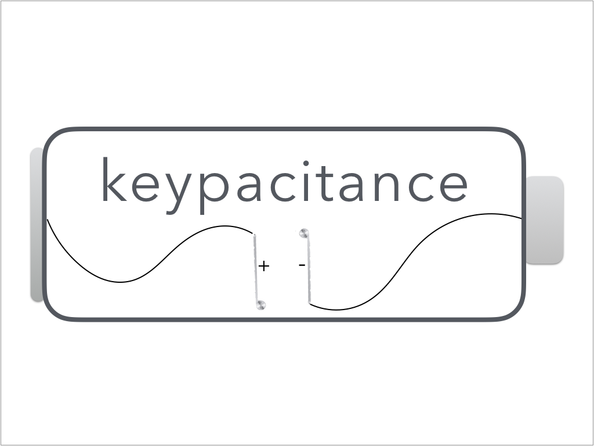

  
  
image source: <a href="https://www.facebook.com/pg/pennapps/photos/" itemprop="citation">PennApps facebook</a>
<!-- /.image-credit -->

<!-- /.page-image -->

> ### This time around we pursue one of my ideas. Effectively a keyboard with capacitive touch key caps that enable an entire new layer of input and interaction with your computer. We demonstrate this new peripheral with A VR killer app that allows you to see where your fingers are on the keyboard while in VR (via a VR keybaord displaying read outs from the real 'touch' keybaord)

# Introduction

<figcaption class="fig-spacing"><i>Another logo creation by me. Potentially a bit dated now but the easter egg here is that the capacitor 'plates' are a profile view of older Apple bluetooth keybaords 🤷‍♂️ .  </i></figcaption>

<!-- /.page-image -->

***keypacitance*** adds a whole new layer of touch input into your computer by way of capacitance touch sensing.
By adding capacitive touch sensors to the individual keys on your keyboard, a new way of interacting with your computer can be realized.
The potential applications and neat projects you can do with this are as numerous as developers are creative.
That being said, our hack focuses on one specific application that we think is pretty cool, VR.

#VR Application
Even the expert typists out there can fumble up on the keyboard if they need to hit a special key or two while in VR. 
And it is silly to think that you have to rip yourself out of the VR world or type something out every time you need to re-orient yourself on your keyboard.
The keypacitence VR application allows you to type on your keyboard unimpeded while experiencing VR.
Wether you are browsing the web, writing some software, or playing games with your VR headset on you will never have to rip off that headset to see where the hell your hands are again.
By simply resting your hands on or dragging your fingers across the keys you are able to see (in VR) exactly which keys are at your fingertips on a VR keyboard in the application.
No need to blindly type a key to see where you’re at or take off your headset.
Working on your desktop in VR just became so much easier!

#Hacking it Together

image source: <a href="https://circuits4you.com/2016/05/13/capacitance-measurement-arduino/" itemprop="citation">circuits4you</a> (and edited by me)

<figcaption class="fig-spacing"><i>The circuit diagram for a single capacitive touch sensor using a Arduino UNO</i></figcaption>

  
  <figcaption class="fig-spacing"><i>Using our basic circuits education we get in E&M to get some capacitors working</i></figcaption>

<!-- /.page-image -->

<!-- /.page-image -->

There were 3 main parts to then project. 
1) Building an Arduino circuit to detect the capacitance of the keys and deliver that information to the computer. 
2) Writing the Unity code to interpret the information on serial connection and translate it into color changes for the keys. 
3) Designing a virtual keyboard in Unity and interfacing that with the code written in step 2.

Due to the obvious time constraints of the competition we decided to begin with converting just three keys on the keyboard, with the option to scale to more if time allowed.
We were also limited to the number of useable pins on the Arduino (sourcing another Arduino was possible but would have made the project unnecessarily complicated).
We used a simple RC circuit design to turn the keys into capacitance sensors.
The circuit diagram for a single capacitor is shown in the figure to the right.
By using one pin on the Arduino as a voltage source, and a second as a sensor, we're able to determine a "charge time" associated with the natural capacitance of the circuit.
A finger touching the copper foil changes the capacitance of the circuit and therefore its charging time.
The Arduino code detects this change, and above a certain threshold indicates the "key" as being touched.
Every 10 milliseconds, all the state of all 3 keys is calculated, and the output is sent from the Arduino to computer via a serial connection.
The fully connected circuit for the three capacitive keys is shown below on the right. 

We then pull this data using a C# script in <a href="https://en.wikipedia.org/wiki/Unity_(game_engine)"> Unity</a> (Links to Arduino and Unity code to come once I get things organized in a repository, or just ask for them in the comments if I am taking forever!).
We treat each key on the virtual keyboard as its own object, and set conditions for the color they manifest based on the information we've pulled from the serial port.
If the Arduino data indicates a key is being touched, we change its color.
Since we treat each key as its own object this method is easily scalable (provided enough power; there is a voltage drop in the source pin associated with the capacitive charging due to multiple key presses) and we are able to register multiple independent key-presses simultaneously.

#The Competition
The competition was effectively a disaster for us this year.
This time around it was actually the earliest we ever had a fully functional proof-of-concept ready to show at the expo.
So we were going in pretty confident.
However our hack required a lot of setup.
Sebastian had to bring his PC from home to be able to even run the Oculus (VR headset).
So in our rush to re-set up everything something went wrong.
Not completely wrong though.
The hack kind-of worked, i.e. it worked sometimes. 
Which was in some ways worse.
We tried to trouble shoot on the fly but we could not figure out the issue before the judge came to our table.
And while I think we did a good job at explaining the hack we were really counting on the pizazz of the judge putting on the VR headset and the hack working as expected.
This of course didn't happen because it was immediately buggy and the judge was underwhelmed.
Of course by the end of the expo we did figure out the issue, a loose (not really 'loose' but not shoved in all the way) USB connection into the Arduino.
Something none of us really considered as we all assumed if there was a faulty connection (which was a leading theory given how it was behaving) it would obviously be somewhere in the hacky wiring of the circuit coming in/out of the Arduino/breadboard and not a standard USB connection.
And so all our time troubleshooting before judgement was spent checking and re-checking those connections.
Ultimately our first place dreams were dahsed as we did not even make it to the second round this time.
But lessons learned and I still think this was a pretty cool hack and something I could easily see existing in today's keybaords.
Thanks for reading!

  
  
image source: <a href="https://www.facebook.com/pg/pennapps/photos/" itemprop="citation">PennApps facebook</a>
<!-- /.image-credit -->

<!-- /.page-image -->
  <figcaption class="fig-spacing"><i>Sebastian (right) and I (left) getting in an early morning photobooth sesh while monchin some bagels on the second day of hacking</i></figcaption>

