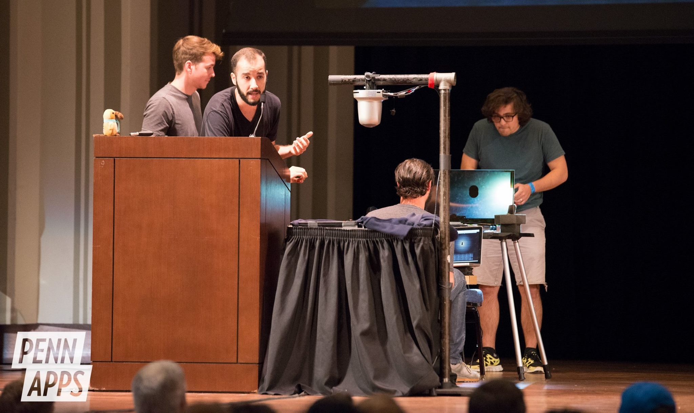
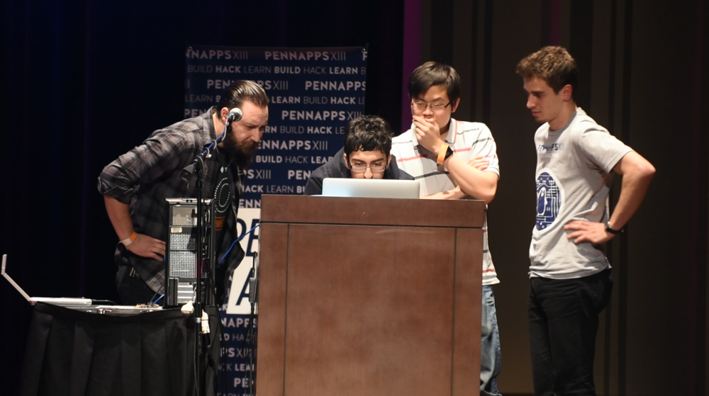

 

In my very first hackathon experience our team of physics PhD students mashed together some transparent LCD hardware, a couple of webcams, and some facial recognition software to create a pretty neat piece of tech and proof of concept. We came away with a few prizes and some patent dreams.     

# What's a Hackathon?

Now if you are not aware, PennApps is one of many student hackathons around the world where students ranging from high school to grad school come together to 'hack' together creative software and hardware projects. Whereby these events use the Frankenstein definition of hacking different things together to make something new and not the  Students work in small teams over the course of 36 hours, functioning on Soylent, coffee, and snacks (all free), in the hopes of bringing their idea to life and also maybe winning some cool prizes ;) 

PennApps also happens to be the biggest student hackathon in the U.S. at the time of writing. Serendipitously the competition just happens to be hosted at The University of Pennsylvania, the institution in which I am doing  my PhD. Also the building that the event takes place in twice a year is right across the street from my office. So the convenience of all of this was pretty ideal. I could even walk home and sleep in my own bed instead of having to pass out on the hard ground of the engineering building like all the other attendees had to. So yeah conditions were choice.  

For me, this all starts with a friend and colleague of mine, Rob Fletcher. Rob really sold me on his first hackathon experience. And well you would probably be sold on it too if your first experience was his. Rob was coming off of the then most recent edition of PennApps, PennApps XV, which just happened to line up with Philly's biggest blizzard that year. Using the blizzard as an excellent excuse to stay inside and hack away for the entire competition, Rob and his team put together a pretty cool piece of [tech](https://devpost.com/software/ramear) (and even got some media attention [1](http://www.thedp.com/article/2016/01/ramear-wins-thirteenth-pennapps), [2](http://observer.com/2016/01/data-is-never-safe-students-in-philadelphia-just-proved-it/)) and ultimately won 1st place overall at the competition.

  
  
Image source: <a href="https://" itemprop="citation">source</a>
<!-- /.image-credit -->

<!-- /.page-image -->
  <figcaption class=""><i>Rob (left, bearded), and his teamates up on stage in the final round of PennAppsXV</i></figcaption>

So before this I had never even heard of this kind of event existing, let alone would have imagined that you could win cool prizes. This whole hackathon thing certainly seemed like my cup of tea. I have always enjoyed trying to think of creative ways to solve problems (often things that inconvenience me and that in my mind should be solved problems) and then trying to run through step by step how exactly I would solve this problem/build this thing. This interest probably has some overlap with me doing a PhD in physics, since most of our training is really learning how to break down problems to their base components and then systematically address each aspect. So after hearing Rob's victory story and how much he enjoyed the experience I was pretty jazzed and certainly on board for the next hackathon.

# PennAppsXVI: The Hackening

Alright, so on to the actual event. My teammates were also all PhDs in the physics department at Penn. The idea for our project was from the then reigning champ, and now teammate, the aforementioned Rob Fletcher. In his own words: 

> The beginnings of this idea came from long road trips. When driving having good visibility is very important. When driving into the sun, the sun visor never seemed to be able to actually cover the sun. When driving at night, the headlights of oncoming cars made for a few moments of dangerous low visibility. Why isn't there a better solution for these things? We decided to see if we could make one, and discovered a wide range of applications for this technology, going far beyond simply blocking light.

So we set out to develop a proof of concept to solve this problem. How? Well, in one dense sentence, We wanted to create a dynamic window heads up display (HUD) that could track real world objects, as well as the user simultaneoulsy, and then have superimposed information on the display on the objects of interest relative to the user. A mock up we made for a presentation during competition can be seen below.

  
  <figcaption><i>Cameras represented by the blue dots are placed on either side of a transparent LCD screen and pointed away from eachother. The fucia dot represents an object that can be rendered on the screen and would lie in the line of sight between the user and the object of interest.</i></figcaption>

<!-- /.page-image -->

So to do this we needed a transparent LCD screen to act as our "windshield" as in the car example given above. Unfortunately these types of displays  are not really readily available (or cheap) as they really only have appeared (as far as I know) as proof of concepts at CES and other such events. So instead we had to settle with a much lower budget option, your every day LCD computer display. The idea was that the monitor, when broken down to it's bare glass, was transparent enough to do what we wanted. Well luckily we did happen to have a LCD monitor with a broken backlight in our office. So there in started the tearing the many more layers of an LCD screen than I had anticipated. I won't go into the details, but at essentially every new layer of the monitor that we had to remove we were all convinced that the project was dead because we couldn't remove that layer. Yet, we persevered and ultimately were able to get the bare glass out of the monitor (and still have it be working!).

  
  <figcaption class="image-right" ><i>The end carnage after the monitor tear down</i></figcaption>

<!-- /.page-image -->

Now with our 'transparent' monitor up and working, a laptop webcam to do the user tracking, and a separate webcam that we bought from a CVS that night to do the oject tracking, we had essentially all the hardware we needed to try to get this hack working. 

On the software side we stumbled upon the open-source facial recognition software "OpenCV." We ultimately used OpenCV's haar cascade classifier in python to perform our facial recognition. Once the facial recognition was done we needed to locate the users eyes in 'pixel space' for the user camera, and locate the light with the other camera in its own pixel space. We then wrote an algorithm that was able to translate the two separate pixel spaces into real 3D space, calculate the line that connects the object and the user, finds the intersection of this line and the monitor, then finally translates this position into pixel space on the monitor in order to render a dot. If you lost count that is three different pixel spaces we are working with. In order to make everything work we had to develop a calibration procedure in order to find the right transforms between these different pixel spaces. The procedure was as follows

  
  <figcaption class="image-right" ><i>Teammates with expressions of great confidence</i></figcaption>

<!-- /.page-image -->
1. Psuedo-randomly place the dot on the screen such that it sampled the screen thouroughly. 
2. For each dot placement have the dot obstruct the light source relative to the user (move head/source around s.t. this is the case).
	 The user and the source must maintain a set distance away from the LCD screen (i.e. in a  plane) during the calibration due to the single camera limitation of our proof of concept. 
3. For each iteration use the equation for a line in a plane to compute the transforms.
4. Fit transforms to find best fit value.

$$ x_{2}=A_{0}x_{0}-A_{1}x_{1}+C_{x} $$

$$ y_{2}=B_{0}y_{0}-B_{1}y_{1}+D_{y} $$

Calibration procedure that we came up with to provide the right transforms between these pixel spaces that we were probably most proud of in the end. 

Another difficulty was getting accurate tracking on the bright light on the far side of the monitor. The web cam we were using was cheap and we had almost no access to the settings like aperture and exposure which made it so the light would easily saturate the CCD in the camera. Because the light was saturating and the camera was trying to adjust its own exposure, other lights in the room were also saturating the CCD and so even bright spots on the white walls were being tracked as well. We eventually solved this problem by reusing the radial diffuser that was on the backlight of the monitor we took apart. This made any bright spots on the walls diffused well under the threshold for tracking. Even after this we had a bit of trouble locating the exact center of the light as we were still getting a bit of glare from the light on the camera lens. We were able to solve this problem by applying a gaussian convolution to the raw video before trying any tracking. This allowed us to accurately locate the center of the light.

# Putting it All Together 

<iframe width="560" height="315" src="https://www.youtube.com/embed/5E8dueHWfjA" frameborder="0" allow="autoplay; encrypted-media" allowfullscreen></iframe>

# The Competition

  
  
Image source: <a href="https://www.facebook.com/pg/pennapps/photos/" itemprop="citation">PennApps facebook</a>
<!-- /.image-credit -->

<!-- /.page-image -->
  <figcaption><i>Our team at the first round explaining to people why they need to sit on this orange milk crate and sit up straight to demo the hack</i></figcaption>

  
  
Image source: <a href="https://www.facebook.com/pg/pennapps/photos/" itemprop="citation">PennApps facebook</a>
<!-- /.image-credit -->

<!-- /.page-image -->
  <figcaption><i>3rd place victory shot!</i></figcaption>

# Summary
The fact that our tracking display worked at all we felt was a huge accomplishments. Every stage of this project felt like a huge victory. We started with a broken LCD monitor and two white boards full of math. Reaching a well working final product was extremely exciting for all of us.

  
  
Image source: <a href="https://www.facebook.com/pg/pennapps/photos/" itemprop="citation">PennApps facebook</a>
<!-- /.image-credit -->

<!-- /.page-image -->
  <figcaption><i>Our team at the first round explaining to people why they need to sit on this orange milk crate and sit up straight to demo the hack</i></figcaption>

  
  
Image source: <a href="https://www.facebook.com/pg/pennapps/photos/" itemprop="citation">PennApps facebook</a>
<!-- /.image-credit -->

<!-- /.page-image -->
  <figcaption><i>Our team at the first round explaining to people why they need to sit on this orange milk crate and sit up straight to demo the hack</i></figcaption>

